<!-- Generated by GitHub Profile Agent Console. Edit profile.config.json, then run npm run generate. -->

  <picture>
    <source media="(max-width: 760px) and (prefers-color-scheme: dark)" srcset="./assets/hero/agent-console-cbf8c41a-mobile-dark.svg">
    <source media="(max-width: 760px)" srcset="./assets/hero/agent-console-cbf8c41a-mobile-light.svg">
    <source media="(prefers-color-scheme: dark)" srcset="./assets/hero/agent-console-cbf8c41a-dark.svg">
    <source media="(prefers-color-scheme: light)" srcset="./assets/hero/agent-console-cbf8c41a-light.svg">
    
  </picture>

  

## About Me

Hi, I'm Erik Adia Meka, an Informatics student who enjoys building modern web applications and learning cybersecurity.

I love creating useful software with Laravel, JavaScript, PHP and MySQL while continuously improving my programming skills.

Besides coding, I'm also building MekaFood Project to support local UMKM through engaging food content.

## Current Focus

| Area | What I am exploring |
| --- | --- |
| **Full Stack Web Development** | Developing responsive, secure and scalable web applications using Laravel, PHP, MySQL, JavaScript, Tailwind CSS and REST APIs. |
| **Cyber Security** | Learning Web Security, OWASP Top 10, SQL Injection, Vulnerability Assessment, Penetration Testing and Secure Coding. |
| **Artificial Intelligence** | Exploring AI tools, automation, Large Language Models, Prompt Engineering and AI-assisted software development. |
| **Content Creation** | Building MekaFood Project through TikTok, Instagram, YouTube Shorts and Facebook by creating engaging food review content. |
| **Continuous Learning** | Always improving programming skills through personal projects, open-source exploration and university assignments. |

## Featured Work

| Project | Focus | Why it matters |
| --- | --- | --- |
| [**KT Pilangsari**](https://github.com/erikadiameka) | Organization Management System | A modern organizational website with news management, member management, authentication and administration dashboard. |
| [**Portfolio Website**](https://github.com/erikadiameka) | Personal Portfolio | A responsive personal portfolio showcasing projects, skills and learning journey as an Informatics student. [Live](https://erikadiameka.github.io/itw2024_project2_243040013/) |
| [**Recon Tools**](https://github.com/erikadiameka) | Cyber Security | A collection of networking and reconnaissance tools developed for learning ethical hacking and security assessment. |
| [**Web Scanner**](https://github.com/erikadiameka) | Web Security | A learning project focused on identifying common web vulnerabilities and improving secure software development practices. |
| [**MekaFood Project**](https://github.com/erikadiameka) | Content Creator | A social media brand dedicated to reviewing local food, supporting UMKM and creating engaging short-form content. |

## Research Direction

I am passionate about building secure web applications, improving backend architecture, learning cybersecurity techniques, and integrating AI into practical software solutions.

## Tech Stack

`HTML5` · `CSS3` · `JavaScript` · `PHP` · `Laravel` · `MySQL` · `Node.js` · `Express.js` · `React Native` · `Expo` · `Python` · `Git` · `GitHub` · `Linux` · `VS Code` · `Postman` · `Tailwind CSS`

## Recent Activity

<!-- AUTO:ACTIVITY:START -->
_Recent public activity will appear here after the workflow runs._
<!-- AUTO:ACTIVITY:END -->

---

  Keep Learning • Keep Building • Keep Sharing 🚀

